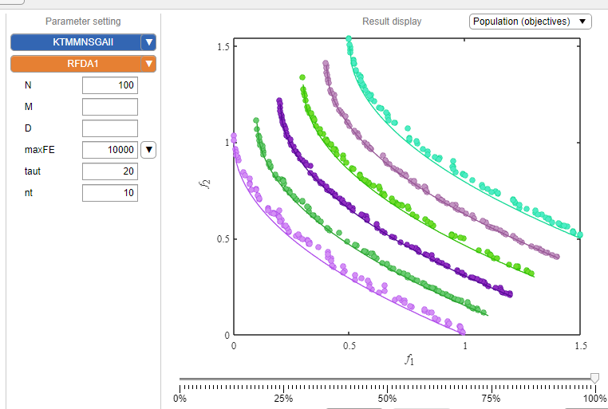

# KTMM-NSGA-II
This code corresponds to the article "J. Zou, Z. Hou, S. Jiang, S. Xiang et al., 'Knowledge Transfer With Mixture Model in Dynamic Multi-Objective Optimization,' in IEEE Transactions on Evolutionary Computation, doi: 10.1109/TEVC.2025.3566481" and is implemented on the [PlatEMO](https://github.com/BIMK/PlatEMO "PlatEMO") [1] platform. Additionally, we have also uploaded the code of the improved test sets (e.g., RDFs [2]) proposed in this paper, which are based on existing test sets (FDAs [3], JYs [4], DFs [5]).

 We welcome discussions and exchanges—please feel free to contact the author, Zhanglu Hou (email: zhanglhou@163.com).

References:

[1]Tian Y, Cheng R, Zhang X, et al. PlatEMO: A MATLAB platform for evolutionary multi-objective optimization [educational forum][J]. IEEE Computational Intelligence Magazine, 2017, 12(4): 73-87.

[2]J. Zou, Z. Hou, S. Jiang, S. Yang, G. Ruan, Y. Xia, Y. Liu, Knowledge transfer with mixture model in dynamic multi-objective optimization, IEEE Transactions on Evolutionary Computation (2025) 1–1 doi:10.1109/TEVC. 2025.3566481

[3]Farina M, Deb K, Amato P. Dynamic multiobjective optimization problems: test cases, approximations, and applications[J]. IEEE Transactions on evolutionary computation, 2004, 8(5): 425-442.

[4]Jiang S, Yang S. Evolutionary dynamic multiobjective optimization: Benchmarks and algorithm comparisons[J]. IEEE transactions on cybernetics, 2016, 47(1): 198-211.

[5]Jiang S, Yang S, Yao X, et al. Benchmark functions for the cec'2018 competition on dynamic multiobjective optimization[R]. Newcastle University, 2018.

